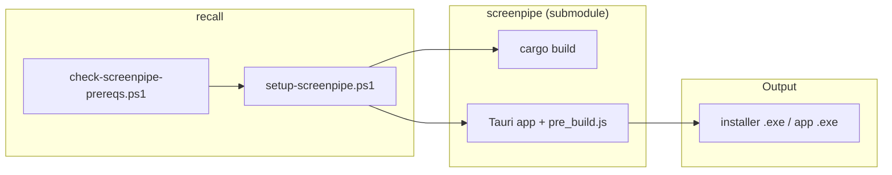

# recall

Personal project integrating [Screenpipe](https://github.com/screenpipe/screenpipe) as a Git submodule for local build and context on Windows.

## Architecture



## Structure

```
recall/
├── README.md
├── docs/                    # Documentation
│   └── SCREENPIPE-SETUP.md  # Screenpipe submodule + build (source-backed)
├── scripts/                 # Automation (run from repo root)
│   ├── check-screenpipe-prereqs.ps1
│   └── setup-screenpipe.ps1
└── screenpipe/              # Git submodule → https://github.com/screenpipe/screenpipe
```

| Area | Role |
|------|------|
| **screenpipe/** | Submodule; clone and update to stay on the latest codebase. |
| **scripts/** | Prerequisite check and build; run from repository root (e.g. `.\scripts\setup-screenpipe.ps1`). |
| **docs/** | Setup and reference; see [docs/SCREENPIPE-SETUP.md](docs/SCREENPIPE-SETUP.md) for full architecture and Mermaid diagrams. |

## Quick start

From the repository root:

1. **Add the Screenpipe submodule** (first time):

   ```powershell
   git submodule add https://github.com/screenpipe/screenpipe screenpipe
   git submodule update --init --recursive
   ```

2. **Check (or auto-install) prerequisites:** (run from repo root, or from `scripts\` use `.\check-screenpipe-prereqs.ps1 -AutoFix`)

   ```powershell
   .\scripts\check-screenpipe-prereqs.ps1 -AutoFix
   ```

   Without `-AutoFix` the script only checks; with `-AutoFix` it installs missing tools via winget and re-checks.

3. **Build:**

   ```powershell
   .\scripts\setup-screenpipe.ps1
   ```

   If prereqs are missing, the build script runs the prereq auto-fix once, then continues.

Full steps, submodule workflow, and source references: **[docs/SCREENPIPE-SETUP.md](docs/SCREENPIPE-SETUP.md)**.

## Documentation

| Document | Contents |
|----------|----------|
| [docs/SCREENPIPE-SETUP.md](docs/SCREENPIPE-SETUP.md) | Repository structure (Mermaid), high-level architecture, Git submodule workflow, prerequisite-check flow, build pipeline, requirements table, quick reference. |
