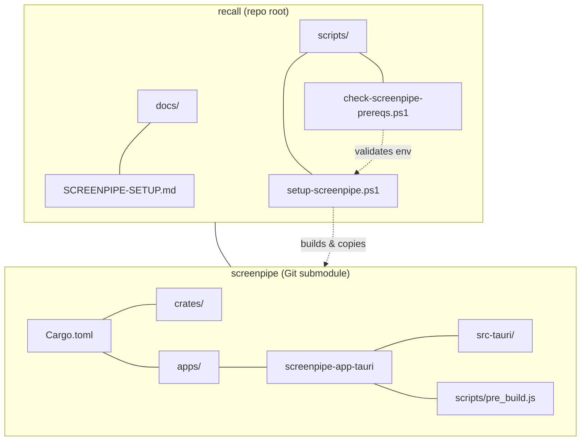
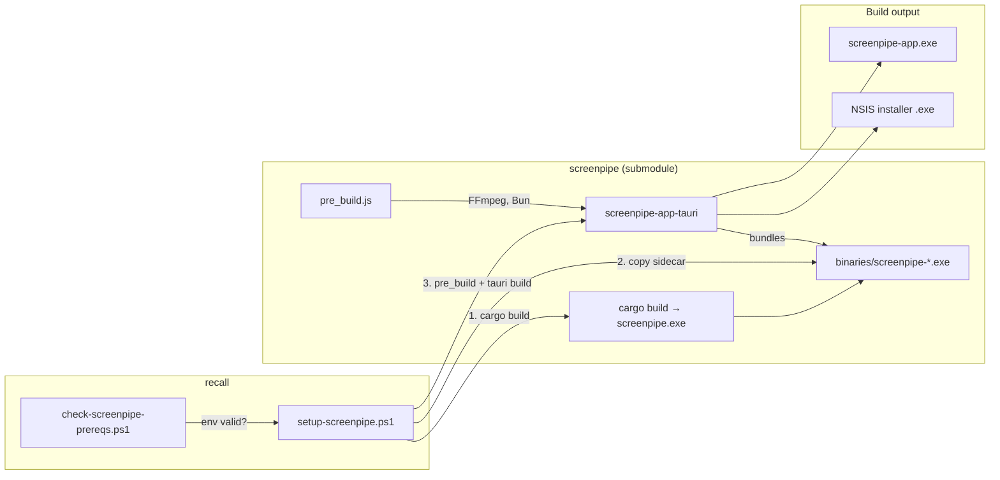
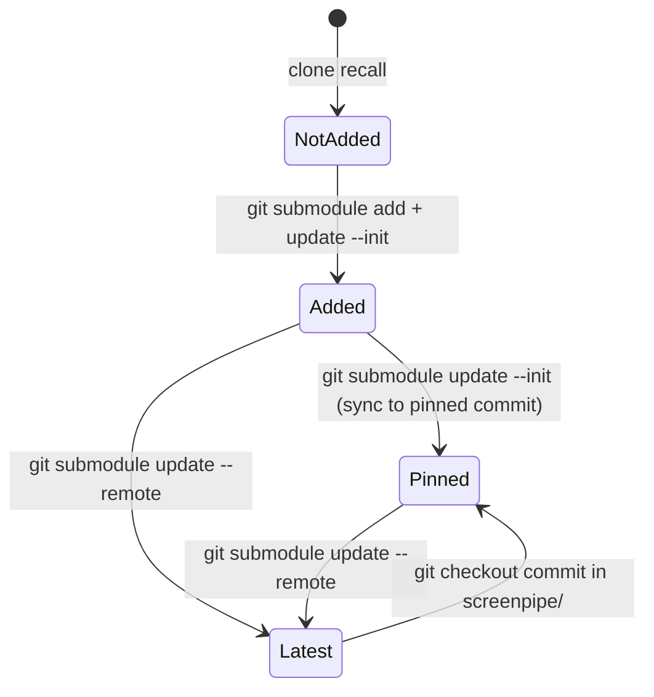
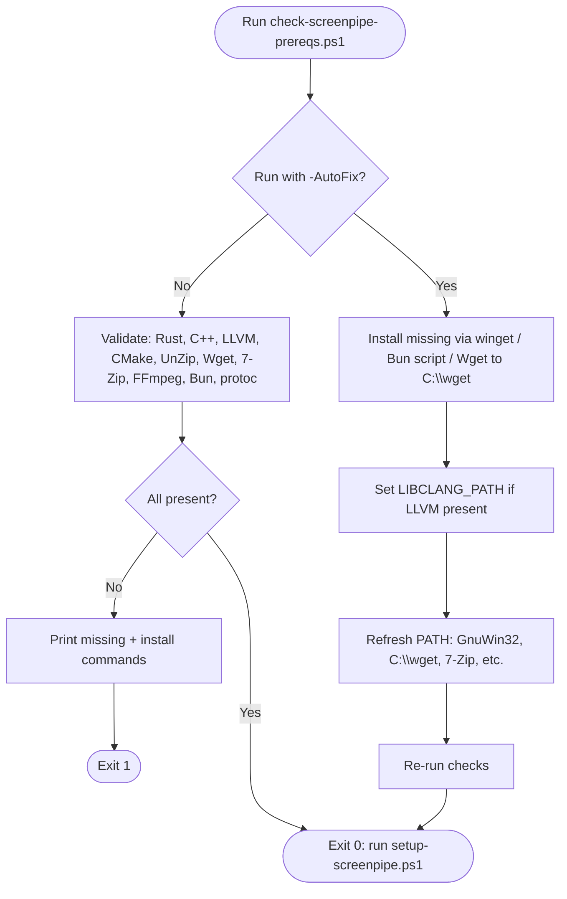
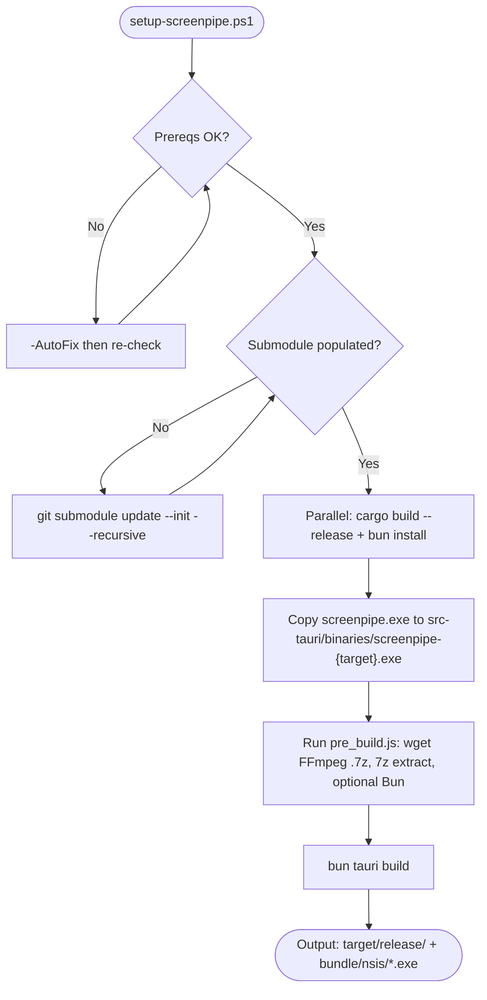
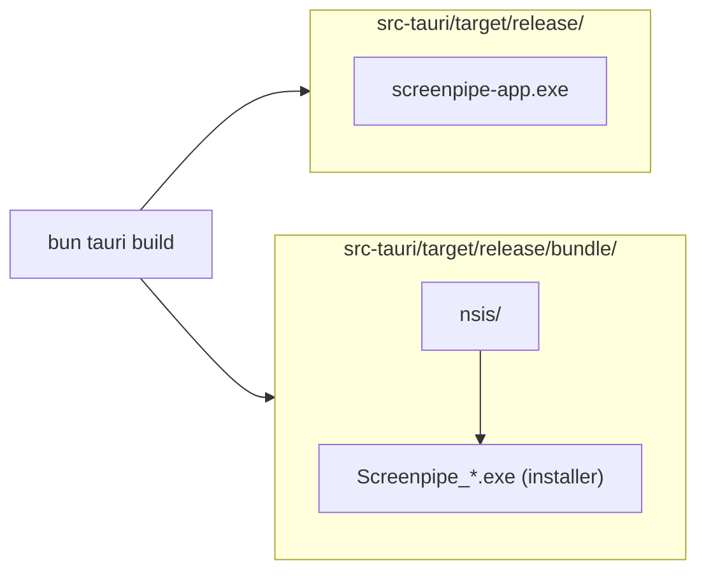

# Screenpipe integration (source-backed)

This project builds [Screenpipe](https://github.com/screenpipe/screenpipe) from a **Git submodule** on Windows. Every requirement and step is tied to upstream files so the implementation stays valid as the codebase changes.

**Doc status:** Links and steps below were checked against upstream `main` (CONTRIBUTING.md, Cargo.toml, Tauri sidecar docs, and Screenpipe’s `scripts/pre_build.js`). CONTRIBUTING’s Windows section does not list `pre_build.js` in step 8; community Windows guides and the repo’s own `pre_build.js` (FFmpeg/Bun sidecars) use it before `bun tauri build`, so we run it too.

**Upstream references:**

| What | Upstream source |
|------|------------------|
| Windows build steps, prerequisites | [CONTRIBUTING.md § Windows](https://github.com/screenpipe/screenpipe/blob/main/CONTRIBUTING.md#windows) |
| Cargo profiles (release, release-dev) | [Cargo.toml](https://github.com/screenpipe/screenpipe/blob/main/Cargo.toml) (`[profile.release]`, `[profile.release-dev]`) |
| Tauri app path, pre_build | [apps/screenpipe-app-tauri](https://github.com/screenpipe/screenpipe/tree/main/apps/screenpipe-app-tauri), [scripts/pre_build.js](https://github.com/screenpipe/screenpipe/blob/main/apps/screenpipe-app-tauri/scripts/pre_build.js) |
| Sidecar / external binaries | [Tauri: Embedding External Binaries](https://tauri.app/develop/sidecar) |
| Install script (reference) | [install.ps1](https://github.com/screenpipe/screenpipe/blob/main/install.ps1) |

---

## Repository structure

```
recall/
├── README.md
├── docs/
│   └── SCREENPIPE-SETUP.md    (this file)
├── scripts/
│   ├── check-screenpipe-prereqs.ps1
│   └── setup-screenpipe.ps1
└── screenpipe/                 (Git submodule → screenpipe/screenpipe)
    ├── Cargo.toml
    ├── apps/
    │   └── screenpipe-app-tauri/
    └── ...
```



**Where to run:** Either from the **repository root** (`recall`) using `.\scripts\...`, or from the **scripts** folder using `.\check-screenpipe-prereqs.ps1` / `.\setup-screenpipe.ps1` (no `scripts\` in the path).

---

## High-level architecture



| Layer | Role |
|-------|------|
| **recall** | Wrapper repo: scripts for prereqs and build; screenpipe as submodule. |
| **screenpipe** | Upstream Rust workspace (crates + Tauri app); built from source. |
| **pre_build.js** | Downloads/bundles FFmpeg (and optional Bun) for the Tauri app. |
| **Tauri app** | Desktop app that embeds the screenpipe binary as a sidecar and produces the installer/app .exe. |

---

## Git submodule: stay on the latest codebase

Screenpipe is included as a **submodule** so you track the same repo as upstream and can update to the latest code when you want.

- **Canonical repo (used in scripts and below):** `https://github.com/screenpipe/screenpipe` — from [CONTRIBUTING.md](https://github.com/screenpipe/screenpipe/blob/main/CONTRIBUTING.md) (clone URL).

### Add the submodule (first time)

From your **repository root** (e.g. `recall`):

```powershell
git submodule add https://github.com/screenpipe/screenpipe screenpipe
git submodule update --init --recursive
```

- **Add:** registers the submodule and clones it into `screenpipe/`.
- **Update --init --recursive:** fetches nested submodules if any and checks out the commit recorded by the parent repo.

### Use the submodule at the current pinned commit

If the submodule is already added and you just need to sync to the commit your repo expects:

```powershell
git submodule update --init --recursive
```

### Update to the latest upstream (track latest codebase)

To point `screenpipe` at the latest `main` of the Screenpipe repo:

```powershell
git submodule update --remote screenpipe
```

Then run a build to confirm everything works; commit the updated submodule pointer when you're satisfied:

```powershell
git add screenpipe
git commit -m "chore: update screenpipe submodule to latest"
```



### Submodule quick reference

| Goal | Command |
|------|--------|
| Add submodule (first time) | `git submodule add https://github.com/screenpipe/screenpipe screenpipe` then `git submodule update --init --recursive` |
| Sync to pinned commit | `git submodule update --init --recursive` |
| Update to latest upstream | `git submodule update --remote screenpipe` |
| See current submodule commit | `git submodule status` |

---

## Phase 1: Git structure

1. Add the submodule (see [Git submodule](#git-submodule-stay-on-the-latest-codebase) above).
2. If `screenpipe` already exists but is empty or only has `.git`, run:

   ```powershell
   git submodule update --init --recursive
   ```

   **scripts\setup-screenpipe.ps1** will also run this automatically if it finds the submodule directory but no `Cargo.toml` or `apps/` inside.

---

## Phase 2: Windows prerequisites

Requirements follow [CONTRIBUTING.md § Windows](https://github.com/screenpipe/screenpipe/blob/main/CONTRIBUTING.md#windows) (steps 2 and 4).



### Check and fix

From the **repository root** (`.\scripts\...`) or from the **scripts** folder (`.\check-screenpipe-prereqs.ps1`):

```powershell
.\scripts\check-screenpipe-prereqs.ps1
```

- **Exit 0:** All required tools are present; you can run `.\scripts\setup-screenpipe.ps1`.
- **Exit 1:** One or more tools missing; the script prints a one-liner to auto-fix and manual winget/choco commands.

**Auto-fix (recommended):** Install missing tools automatically via winget (and Bun via official script), set `LIBCLANG_PATH`, refresh PATH, then re-check:

```powershell
.\scripts\check-screenpipe-prereqs.ps1 -AutoFix
```

First run can take several minutes (e.g. Rust, LLVM downloads). If a package needs elevation, run the same command in an elevated (Admin) prompt.

Optional:

- **`-AutoFix`** — Install missing tools with winget/Bun, set LIBCLANG_PATH, refresh PATH, then re-run checks. Does the heavy lifting so you don’t copy-paste install commands.
- **`-Fix`** — Only set User env vars (e.g. `LIBCLANG_PATH`) when LLVM is present; do not run winget.
- **`-Quiet`** — Used by setup-screenpipe.ps1; only prints missing tools and install commands.

**setup-screenpipe.ps1** runs prereq check first; if anything is missing it runs **check-screenpipe-prereqs.ps1 -AutoFix** once (unless you pass **-InstallPrereqs:$false**), then re-checks before building.

### Requirement ↔ upstream

| Requirement | Upstream | How we check |
|-------------|----------|----------------|
| Rust (cargo, rustc) | CONTRIBUTING.md step 2: `Rustlang.Rustup` | `Get-Command cargo/rustc`, `cargo --version` |
| C++ Build Tools | CONTRIBUTING.md step 2: `Microsoft.VisualStudio.2022.BuildTools` + C++ workload | vswhere `VC.Tools.x86.x64` |
| LLVM/Clang | CONTRIBUTING.md steps 2 & 4: `LLVM.LLVM`, `LIBCLANG_PATH` | `C:\Program Files\LLVM\bin\clang.exe` or `$env:LIBCLANG_PATH` |
| CMake | CONTRIBUTING.md step 2: `Kitware.CMake`; required by whisper-rs-sys | `Get-Command cmake` |
| UnZip (GnuWin32) | CONTRIBUTING.md step 2: `GnuWin32.UnZip`; required by screenpipe-audio build.rs | `Get-Command unzip` |
| Wget | pre_build.js (downloads Windows FFmpeg); AutoFix installs to `C:\wget` | `C:\wget\wget.exe` or `wget.exe` in PATH |
| 7-Zip | pre_build.js (extracts FFmpeg .7z) | `7z` in PATH or `C:\Program Files\7-Zip\7z.exe` |
| FFmpeg in PATH | CONTRIBUTING.md vcpkg ffmpeg / pre_build.js | `Get-Command ffmpeg` |
| Bun | CONTRIBUTING.md step 2: `irm https://bun.sh/install.ps1 \| iex` | `Get-Command bun`, `bun --version` |
| protoc | Often required by Rust/crypto crates | `Get-Command protoc` |

**Extra tools in CONTRIBUTING (step 2):** CMake, GnuWin32.UnZip, Git, Wget, 7zip. Our prereq script checks **Wget** (AutoFix installs to `C:\wget`) and **7-Zip** (AutoFix via `winget install 7zip.7zip`).

Full Windows setup (vcpkg, vcredist, Intel OpenMP, etc.) is in [CONTRIBUTING.md § Windows](https://github.com/screenpipe/screenpipe/blob/main/CONTRIBUTING.md#windows). Our scripts assume a working Rust + C++ + LLVM + FFmpeg + Bun environment; use the script's install commands or CONTRIBUTING for anything missing.

---

## Phase 3 & 4: Build (sidecar strategy)

From the **repository root**:

```powershell
.\scripts\setup-screenpipe.ps1
```



### What the script does (and where it comes from)

1. **Prereq check** — Runs `scripts\check-screenpipe-prereqs.ps1 -Quiet` and exits with a clear message if anything is missing (see [Phase 2](#phase-2-windows-prerequisites)).
2. **Submodule auto-fix** — If `screenpipe` exists but has no `Cargo.toml` or `apps/`, runs `git submodule update --init --recursive` once.
3. **Cargo build** — Builds the core binary: `cargo build --profile release --bin screenpipe` in `screenpipe/` (same as [CONTRIBUTING.md step 8](https://github.com/screenpipe/screenpipe/blob/main/CONTRIBUTING.md#windows): `cargo build --release`).
4. **Sidecar copy** — Copies `screenpipe.exe` to `screenpipe/apps/screenpipe-app-tauri/src-tauri/binaries/screenpipe-<target>.exe` so Tauri can bundle it ([Tauri sidecar](https://tauri.app/develop/sidecar), target triple from `rustc -vV`).
5. **Tauri app** — In `screenpipe/apps/screenpipe-app-tauri`: `bun install`, then `bun run scripts/pre_build.js` ([pre_build.js](https://github.com/screenpipe/screenpipe/blob/main/apps/screenpipe-app-tauri/scripts/pre_build.js): FFmpeg/Bun sidecars), then `bun tauri build` ([CONTRIBUTING.md step 8](https://github.com/screenpipe/screenpipe/blob/main/CONTRIBUTING.md#windows)).

Build output: `screenpipe/apps/screenpipe-app-tauri/src-tauri/target/release/` (installer or executable).



### Build options

| Option | Description | Source |
|--------|-------------|--------|
| `-Fast` | Use Cargo profile **release-dev** (faster compile, still optimized) | [Cargo.toml `profile.release-dev`](https://github.com/screenpipe/screenpipe/blob/main/Cargo.toml) |
| `-NoParallel` | Disable parallel `bun install` | — |
| `-SkipPrereqCheck` | Skip prerequisite check (use only if already validated) | — |
| (default) | If prereqs fail, run **check-screenpipe-prereqs.ps1 -AutoFix** once then re-check | — |
| `-NoInstallPrereqs` | Do not auto-install missing tools; fail immediately if prereqs missing | — |

---

## Verification

To confirm the implementation works:

1. **Prereqs:** Run `.\scripts\check-screenpipe-prereqs.ps1`. Resolve any missing tools and re-run until exit code is 0.
2. **Submodule:** Ensure `screenpipe` is present and populated: `git submodule status` and presence of `screenpipe/Cargo.toml` and `screenpipe/apps/`.
3. **Build:** Run `.\scripts\setup-screenpipe.ps1`. It will fail with explicit errors (prereqs, submodule, cargo, bun, tauri) and point to this doc or upstream where relevant.
4. **Output:** Check that the built artifact exists under `screenpipe/apps/screenpipe-app-tauri/src-tauri/target/release/` (e.g. `.exe` or installer).

---

## CI / GitHub Actions

A workflow **Build Screenpipe (Windows)** (`.github/workflows/build-screenpipe.yml`) builds the installer on Windows and uploads the `.exe`.

**When it runs:** On push to `main`, on push of a tag `v*`, or manually via **Actions → Build Screenpipe (Windows) → Run workflow**.

**What it uses:** The **screenpipe commit pinned in this repo** (the submodule pointer). It does *not* run `git submodule update --remote` in CI. So:
- **To build the same version you have locally:** Push your branch (and the current submodule commit); the workflow checks out that commit and builds it.
- **To build a newer Screenpipe:** Run `git submodule update --remote screenpipe` (or pin a specific commit), commit the updated submodule pointer, push. The next run will build that version.

**Outputs:**
- **Artifacts:** Every run uploads the NSIS installer (`.exe`) as an artifact **screenpipe-installer-windows**. Download it from the run’s summary page.
- **Release:** If you push a tag `v*` (e.g. `v1.0.0`), the workflow creates a **draft GitHub Release** for that tag and attaches the `.exe`. You can publish the draft when ready. Manual run with input **Create Release** = true creates a draft release for the current ref (e.g. `main`).

---

## Quick reference

| Step | Command |
|------|--------|
| Add submodule | `git submodule add https://github.com/screenpipe/screenpipe screenpipe` then `git submodule update --init --recursive` |
| Update to latest upstream | `git submodule update --remote screenpipe` (then commit and push to have CI build it) |
| Sync to pinned commit | `git submodule update --init --recursive` |
| Check prerequisites | `.\scripts\check-screenpipe-prereqs.ps1` |
| Auto-install missing tools | `.\scripts\check-screenpipe-prereqs.ps1 -AutoFix` |
| Check + set LIBCLANG_PATH only | `.\scripts\check-screenpipe-prereqs.ps1 -Fix` |
| Build | `.\scripts\setup-screenpipe.ps1` |
| Fast build (release-dev) | `.\scripts\setup-screenpipe.ps1 -Fast` |

---

## Implementation vs upstream

| Aspect | Upstream (CONTRIBUTING.md) | Our implementation |
|--------|----------------------------|--------------------|
| Repo | Clone once | **Submodule** so we can track/update to latest |
| Prereqs | Manual install per CONTRIBUTING | **scripts\check-screenpipe-prereqs.ps1** validates and prints install commands; optional **-Fix** for LIBCLANG_PATH |
| Submodule empty | N/A | **scripts\setup-screenpipe.ps1** runs `git submodule update --init --recursive` once if needed |
| Build order | `cargo build --release` then `cd apps/...; bun install; bun tauri build` | Same, plus **parallel** bun install during cargo, **optional** release-dev profile, **explicit** sidecar copy, and **pre_build.js** before `bun tauri build` |
| Sidecar | Tauri expects binary in src-tauri/binaries | We build in repo root then **copy** to `binaries/screenpipe-<target>.exe` (Tauri convention) |

All of the above is backed by the upstream sources linked in the first table and in each section.
